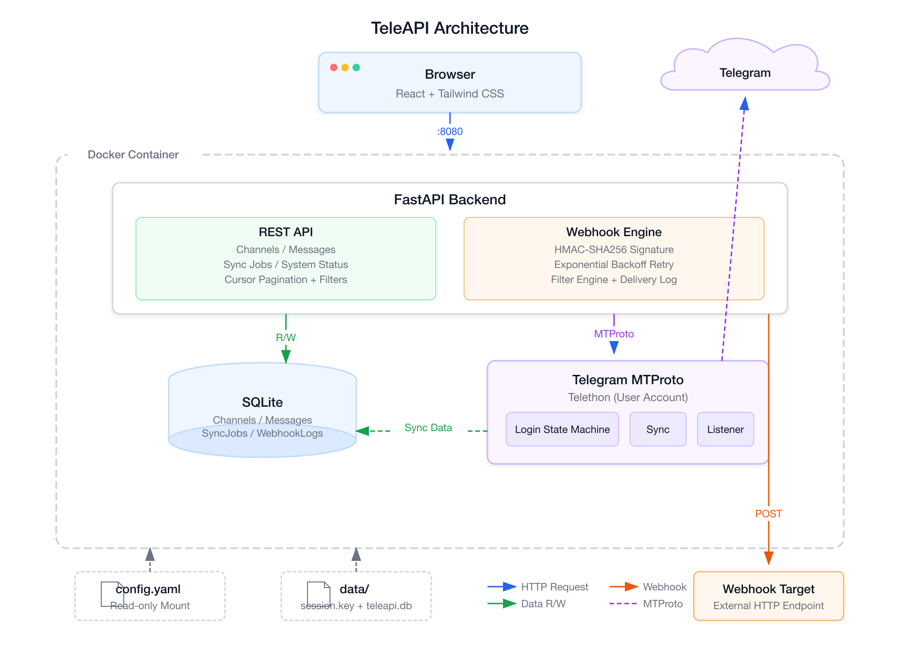

<div align="center">

<h1>TeleAPI</h1>

<p><strong>把 Telegram 频道变成你的结构化数据 API。</strong></p>

<p>
  <a href="https://github.com/zzf2333/TeleAPI/actions"></a>
  <a href="LICENSE"></a>
  
  
</p>

</div>

---

TeleAPI 是一个轻量级 Telegram 频道 API 网关。它以用户账号连接 Telegram，将你已订阅的频道内容同步、结构化、存储，并转换为可被外部系统调用的 REST API 和 Webhook 数据源。

---

## 它能做什么

| 能力 | 说明 |
|------|------|
| **多方式登录** | QR 扫码 / 手机号验证码 / 2FA 云密码 |
| **频道管理** | 前端动态增删频道，运行时热重载，支持增量与全量历史同步 |
| **实时监听** | 新消息自动入库，毫秒级延迟 |
| **REST API** | 频道列表、消息查询（游标分页、关键词/类型/时间过滤） |
| **Webhook 推送** | HMAC-SHA256 签名、指数退避重试、推送日志 |
| **过滤引擎** | 关键词 / 正则 / 频道 / 消息类型，多维度组合 |
| **管理界面** | React + Tailwind 轻量后台，全中文 |
| **一键部署** | Docker Compose，多阶段构建 |

---

## 快速开始

### 前置条件

- Docker 和 Docker Compose（推荐）
- 或 Python 3.12+ 和 [uv](https://github.com/astral-sh/uv)（本地开发）
- Telegram API 凭证（`api_id` + `api_hash`）

### 1. 获取 Telegram API 凭证

前往 [my.telegram.org](https://my.telegram.org) → API development tools → 创建应用，获取 `api_id` 和 `api_hash`。

### 2. 配置

```bash
cp config.example.yaml config.yaml
```

编辑 `config.yaml`，填入：

- `telegram.api_id` 和 `telegram.api_hash`
- `security.admin_api_key`（至少 16 位，不可使用弱密码）
- 需要监听的频道列表

### 3. 启动

**Docker（推荐）：**

```bash
docker compose up -d
```

**本地：**

```bash
uv sync && make dev
```

### 4. 登录

打开 `http://localhost:8080`，输入 Admin API Key，选择 QR 扫码或手机号验证码登录。

---

## Docker 部署

### 架构

<p align="center">
  
</p>

### 启动

```bash
# 构建并启动
docker compose up -d

# 查看日志
docker compose logs -f

# 停止
docker compose down
```

### 数据持久化

| 路径 | 说明 |
|------|------|
| `./data/teleapi.db` | SQLite 数据库（频道、消息、同步任务、Webhook 日志） |
| `./data/session.key` | Telegram 登录会话（登录后自动生成） |
| `./config.yaml` | 配置文件（只读挂载进容器） |

`data/` 目录通过 Docker volume 持久化，重启容器不会丢失数据和登录状态。

### 纯环境变量部署

不挂载 `config.yaml`，改用环境变量 + 内置默认值：

```yaml
services:
    teleapi:
        image: teleapi
        ports:
            - "8080:8080"
        volumes:
            - ./data:/app/data
        environment:
            - TELEAPI_TELEGRAM_API_ID=123456
            - TELEAPI_TELEGRAM_API_HASH=your_api_hash
            - TELEAPI_SECURITY_ADMIN_API_KEY=your_strong_key_here
```

### 自定义端口

```yaml
services:
    teleapi:
        ports:
            - "3000:8080"    # 宿主机 3000 → 容器 8080
```

### 健康检查

容器内置健康检查，每 30 秒检测一次 `/health` 端点：

```bash
docker inspect --format='{{.State.Health.Status}}' teleapi-teleapi-1
```

---

## 本地开发

```bash
# 安装依赖
make install

# 一键启动前后端（自动清理残留进程）
make dev

# 或分别启动
uv run uvicorn teleapi.main:app --host 0.0.0.0 --port 8080 --reload  # 后端
cd frontend && npm install && npm run dev                              # 前端
```

### 常用命令

```bash
make test          # 全量 234 个测试
make lint          # Ruff lint
make build         # 构建前端
make docker-build  # 构建 Docker 镜像
make docker-up     # 启动容器
make docker-down   # 停止容器
make docker-logs   # 查看日志
```

### 按层级运行测试

```bash
uv run pytest -m unit      # 纯逻辑
uv run pytest -m db        # 数据库
uv run pytest -m service   # 服务层
uv run pytest -m api       # API 路由
uv run pytest -m e2e       # 端到端
```

---

## API

启动后访问 `http://localhost:8080/api/docs` 查看交互式 OpenAPI 文档。

### 端点一览

| 方法 | 路径 | 说明 |
|------|------|------|
| GET | `/health` | 健康检查（无需鉴权） |
| POST | `/api/auth/qr-login` | QR 扫码登录 |
| POST | `/api/auth/phone-login/send-code` | 手机号验证码登录 |
| GET | `/api/auth/status` | 登录状态 |
| GET | `/api/channels` | 频道列表 |
| POST | `/api/channels` | 添加订阅频道 |
| PUT | `/api/channels/{id}` | 启用 / 禁用频道 |
| DELETE | `/api/channels/{id}` | 删除频道及关联数据 |
| GET | `/api/channels/{id}/messages` | 频道消息（分页、搜索） |
| POST | `/api/channels/{id}/sync` | 触发历史同步 |
| GET | `/api/sync-jobs` | 同步任务列表 |
| GET | `/api/webhook-deliveries` | Webhook 推送日志 |
| GET | `/api/system/status` | 系统状态 |
| GET | `/api/system/config-check` | 配置检查 |

### 鉴权

除 `/health` 外，所有 API 需要携带密钥：

```
Authorization: Bearer <your_admin_api_key>
```

或：

```
X-TeleAPI-Key: <your_admin_api_key>
```

---

## Webhook

TeleAPI 在新消息到达时向配置的 URL 推送事件，支持：

- **HMAC-SHA256 签名** — `X-TeleAPI-Signature` + `X-TeleAPI-Timestamp` 头
- **失败重试** — 可配置重试次数和退避间隔
- **过滤器** — 只推送匹配规则的消息
- **推送日志** — 所有投递记录可通过 API 查询

```yaml
# config.yaml 示例
outputs:
  webhooks:
    - name: "my-webhook"
      url: "https://example.com/webhook"
      secret: "your_webhook_secret"
      events: ["message.created"]
      channels: ["target_channel"]
      filters: ["important-only"]
      retry:
        max_attempts: 3
        backoff_seconds: [5, 30, 120]
```

---

## 环境变量

支持通过环境变量覆盖配置文件中的敏感字段：

| 变量 | 覆盖字段 |
|------|----------|
| `TELEAPI_TELEGRAM_API_ID` | `telegram.api_id` |
| `TELEAPI_TELEGRAM_API_HASH` | `telegram.api_hash` |
| `TELEAPI_SECURITY_ADMIN_API_KEY` | `security.admin_api_key` |
| `TELEAPI_DATABASE_URL` | `database.url` |
| `TELEAPI_CONFIG` | 配置文件路径（默认 `config.yaml`） |

---

## License

[MIT](LICENSE)
